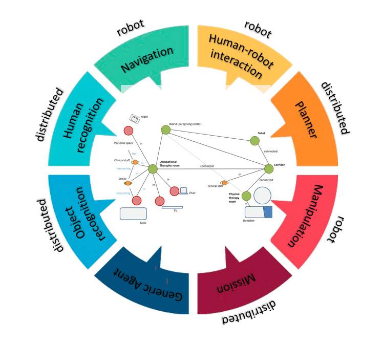

# dsr_ros


[](https://github.com/grupo-avispa/dsr_ros/actions/workflows/build.yml)
[](https://codecov.io/gh/grupo-avispa/dsr_ros)

## Overview

A ROS 2 stack that contains agents, interfaces and RQT plugins for connecting to CORTEX architecture using a Deep State Representation (DSR) graph.

 * [dsr_agents]: agents to connect to CORTEX architecture.
 * [dsr_bridge]: bridge to connect two different DSR graphs through ROS 2.
 * [dsr_msgs]: messages and services to interact with the DSR agents and ROS.
 * [dsr_rqt_plugin]: RQT plugin to visualize a Deep State Representation (DSR) graph.
 * [dsr_util]: utilities to work with DSR graphs.



**Keywords:** ROS2, DSR, RQT

### License

**Author: Alberto Tudela, José Galeas Merchan, Óscar Pons Fernández<br />**

The dsr_ros package has been tested under [ROS2] Humble on [Ubuntu] 22.04. This is research code, expect that it changes often and any fitness for a particular purpose is disclaimed.

## Installation

### Building from Source

#### Dependencies

- [Robot Operating System (ROS) 2](https://docs.ros.org/en/humble/) (middleware for robotics)
- [Cortex](https://github.com/grupo-avispa/cortex) (DSR library)
- [FAST-DDS](https://github.com/eProsima/Fast-DDS) (eprosima Fast DDS)

#### Building

To build from source, clone the latest version of the repository into your colcon workspace and compile the package using the following commands:
```bash
cd colcon_workspace/src
git clone https://github.com/grupo-avispa/dsr_ros.git -b humble
cd ../
rosdep install -i --from-path src --rosdistro humble -y
colcon build --symlink-install
```

[dsr_agents]: ./dsr_agents
[dsr_bridge]: ./dsr_bridge
[dsr_msgs]: ./dsr_msgs
[dsr_rqt_plugin]: ./dsr_rqt_plugin
[dsr_util]: ./dsr_util

[Ubuntu]: https://ubuntu.com/
[ROS2]: https://docs.ros.org/en/humble/