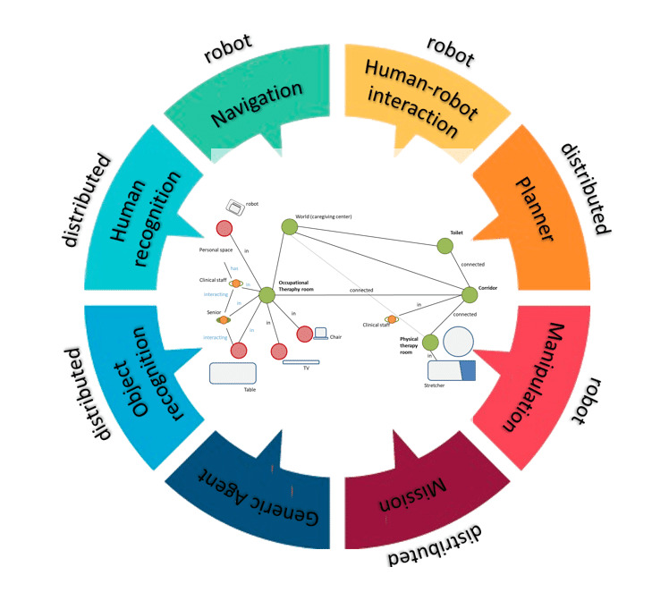

# dsr_ros


[](https://github.com/grupo-avispa/dsr_ros/actions/workflows/build.yml)
[](https://github.com/grupo-avispa/dsr_ros/actions/workflows/docker_image.yml)
[](https://codecov.io/gh/grupo-avispa/dsr_ros)

## Overview

A ROS 2 stack that contains agents, interfaces and RQT plugins for connecting to CORTEX architecture using a Deep State Representation (DSR) graph.

 * [dsr_agents]: agents to connect to CORTEX architecture.
 * [dsr_bringup]: launch files to start the agents.
 * [dsr_bridge]: bridge to connect two different DSR graphs through ROS 2.
 * [dsr_msgs]: messages and services to interact with the DSR agents and ROS.
 * [dsr_rqt_plugin]: RQT plugin to visualize a Deep State Representation (DSR) graph.
 * [dsr_util]: utilities to work with DSR graphs.



**Keywords:** ROS2, DSR, RQT

### License

**Author: Alberto Tudela, José Galeas Merchan, Óscar Pons Fernández<br />**

The dsr_ros package has been tested under [ROS2] Jazzy on [Ubuntu] 24.04. This is research code, expect that it changes often and any fitness for a particular purpose is disclaimed.

## Installation

### Building from Source

#### Dependencies

- [Robot Operating System (ROS) 2](https://docs.ros.org/en/jazzy/) (middleware for robotics)
- [Cortex](https://github.com/grupo-avispa/cortex) (DSR library)
- [FAST-DDS](https://github.com/eProsima/Fast-DDS) (eprosima Fast DDS)

#### Building

To build from source, clone the latest version of the repository into your colcon workspace and compile the package using the following commands:
```bash
cd colcon_workspace/src
git clone https://github.com/grupo-avispa/dsr_ros.git -b jazzy
cd ../
rosdep install -i --from-path src --rosdistro jazzy -y
colcon build --symlink-install
```

#### Acknowledgements
If you find this research useful, kindly cite the paper:
```bibtex

@Article{electronics20244583,
author = {Galeas, José and Tudela, Alberto and Pons, Óscar and Bandera, Juan Pedro and Bandera, Antonio},
title = {Design of a Cyber-Physical System-of-Systems Architecture for Elderly Care at Home},
journal = {Electronics},
volume = {13},
year = {2024},
number = {23},
article-number = {4583},
url = {https://www.mdpi.com/2079-9292/13/23/4583},
issn = {2079-9292},
doi = {10.3390/electronics13234583}
}
```

[dsr_agents]: ./dsr_agents
[dsr_bridge]: ./dsr_bridge
[dsr_bringup]: ./dsr_bringup
[dsr_msgs]: ./dsr_msgs
[dsr_rqt_plugin]: ./dsr_rqt_plugin
[dsr_util]: ./dsr_util

[Ubuntu]: https://ubuntu.com/
[ROS2]: https://docs.ros.org/en/jazzy/
