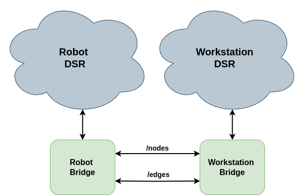

# dsr_bridge

## Overview

This package provides a communication bridge between two instances of the Deep Space Representation (DSR) using ROS 2. The bridge is able to capture the signals from the DSR, create the corresponding nodes / edges messages and publish them through ROS 2. The other side of the bridge is able to receive the nodes / edges messages and create the corresponding nodes / edges in the DSR.

## Usage

To use this package, first modify the `default_params.yaml` file located in the `params` directory to set the *source* option for the robot side and the other side.

Launch the bridge in the robot side using the following command:

	ros2 launch dsr_bridge dsr_bridge_robot.launch.py

Launch the bridge in the other side using the following command:

	ros2 launch dsr_bridge dsr_bridge_nuc.launch.py

## Nodes

### dsr_bridge

Node that receives the messages from the DSR side and creates the corresponding nodes in the ROS.

#### Subscribed / Published Topics

* **`nodes`**

	Topic where the nodes from the DSR are received / published.

* **`edges`**

	Topic where the edges from the DSR are received / published.

#### Parameters

* **`include_nodes`** (string, default: "")

	Comma separated list of nodes to be sent to the other DSR bridge.

* **`exclude_nodes`** (string, default: "")

	Comma separated list of nodes to be excluded from the nodes to be sent to the other DSR bridge.

#### Parameters (common for all agents)

* **`agent_name`** (string, default: "")

	The name of the agent that will be used.

* **`agent_id`** (int, default: 0)

	A unique identifier for the agent.

* **`dsr_input_file`** (string, default: "") (Optional)

	The path to the DSR file that will be loaded.

* **`source`** (string, default: "robot")

	The source of the nodes / edges.

## Future work
- [x] Convert nodes to LifeCycleNodes.
- [x] Store the edges if the nodes are not available. and re-send them when the nodes are available.
- [x] Add filtering options for the nodes / edges.
- [ ] Add resync function.

[Ubuntu]: https://ubuntu.com/
[ROS2]: https://docs.ros.org/en/humble/

