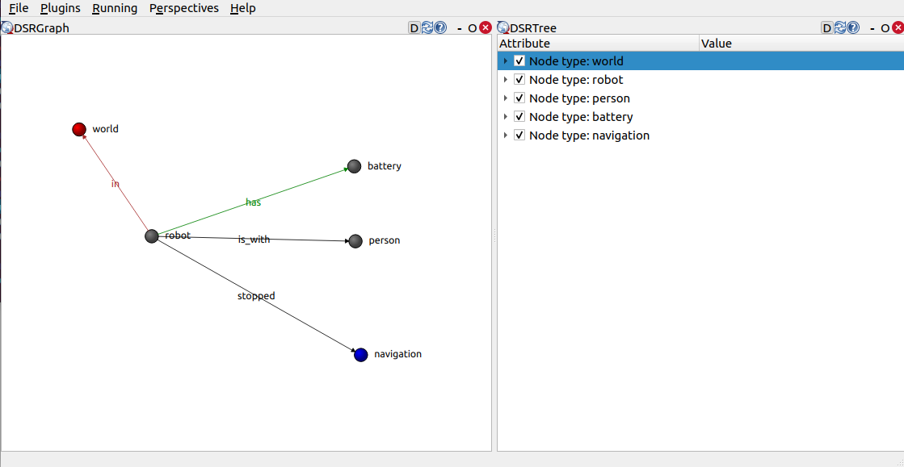

# dsr_rqt_plugin

## Overview

[RQT] plugin to visualize a Deep State Representation (DSR) graph. 

*View of the DSR with a world*

**Keywords:** ROS2, DSR, RQT

### License

**Author: Alberto Tudela **

The dsr_rqt_plugin package has been tested under [ROS2] Humble on [Ubuntu] 22.04. This is research code, expect that it changes often and any fitness for a particular purpose is disclaimed.

## Usage

Launch your DSR nodes as usual and then open RQT. You will see a new plugin called "DSR View".

[Ubuntu]: https://ubuntu.com/
[ROS2]: https://docs.ros.org/en/humble/
[RQT]: https://github.com/ros-visualization/rqt
